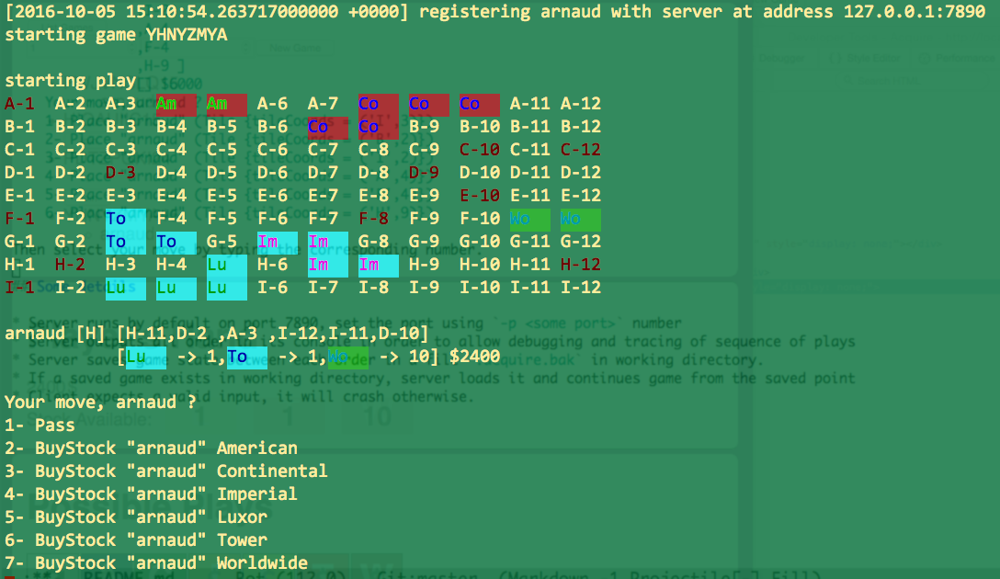
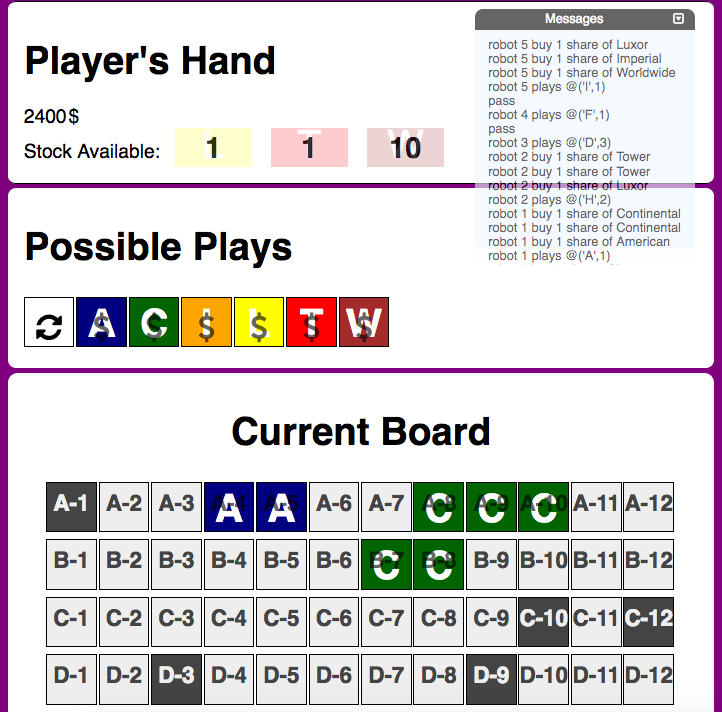

# Acquire in Haskell + Elm

This is an implementation of the [Acquire](http://www.webnoir.com/bob/sid/acquire.htm) boardgame as a client-server online game, using [Haskell](httP;//haskell.org) as a backend and game engine, and [Elm](http://elm-lang.org) . It is a not-so-quick-still-dirty implementation but in the few tests I already make, it appears playable at least locally.

# Overview

The game can be played in two different ways:

* As a pure text-based client-server, using an ANSI capable terminal, 
* Using an HTML interface.

The core game server itself is of course agnostic about which front-end it is played with: 

* It can host several games concurrently,
* Client players can create a new game or list existing games,
* Client players can join an existing non-started game.

## Building

Run `stack build` in top-level directory, this will build all needed executables.

## Command-Line Mode

### Getting Started ###

To play in solo mode against robots, run the following commands in the source tree, assuming you are using
[stack](https://github.com/commercialhaskell/stack) to build code (works equally well with cabal with more incantations):

### Start a Server

    $ stack init
    $ stack build
    $ stack exec hsg -- server

The server supports a single option `-p <port>` to select the port it listens to. If passed 0, it will listen on a random port and
print it on stdout:

```
$ stack exec hsg -- server -p 0
[2016-10-05 14:07:20.538190000000 +0000] garbage collecting
[2016-10-05 14:07:20.534807000000 +0000] Server started on port 54824
```

### Create a New Game

Open another terminal and run:

    $ stack exec hsg --  newGame -H 1 -R 5
    created new game DBEGXBIZ

This creates a new game with one human and five robot players.

The `newGame` command supports the following option:

```
Usage: hsg newGame [-h|--host HOST] [-p|--port PORT] [-H|--num-humans NUMBER]
                   [-R|--num-robots NUMBER]
```

To check a game is available, use the `list` command:

    $ stack exec hsg -- list
    DBEGXBIZ 3 humans, 3 robots, []

The `list` command supports the following option:

```
Usage: hsg list [-h|--host HOST] [-p|--port PORT]
```

### Start Playing

Assuming you created the above defined solo game, you can connect as a player to start playing the game:

    $ stack exec hsg -- player -g DBEGXBIZ -n arnaud
    registering arnaud with server at address 127.0.0.1:7890
    registered player arnaud with game DBEGXBIZ
    starting game DBEGXBIZ

The `player` command as the following options:

```
Usage: hsg player [-h|--host HOST] [-p|--port PORT] (-n|--player NAME)
                  (-g|--game GAME ID) [-t|--player-type PLAYER-TYPE]
```

The `--player` name and `--game` ID parameters are mandatory.

You should see something like the following:



To play, type the selected number before the list of possible plays and press `Enter`. Refer to the rules of the game for further
directions.

## Web-based UI

To start web server, run the following command:

```
$ stack exec server
```

> There currently aren't any option. Server starts on port 9090 and should be accessed locally

### Building UI

```
$ cd ui
$ elm-make src/Acquire.elm --output=acquire.js
```

### Playing

* Point your browser at `http://localhost:9090/index.html` to load the UI. 
* Enter your `Player Name` in the related field,
* Click on `List Games`. If there are saved games, you should see them listed, otherwise you can create a new game, selecting the
  number of humans and robot players and clicking on `New Game`,
* To start playing a game, click on `Join`. If the required number of human players is connected, the game starts and the board is
  displayed. 
* If its your turn to play, you should see boxes appearing in the `Possible Plays` area: Click on a box to select that play,
* On the top right, there is `Messages` box whose visibility can be toggled on and off: It lists all messages sent by server and
  notably all other player's plays, most recent first.
  
### Screenshots




## Some details

* Server saves game state between each order in a file `.acquire.<game-id>.bak` in its working directory,
* If a saved game exists in working directory, server loads it and continues game from the saved point. This means if something goes
  wrong, it's enough to restart server and get back to last play,
